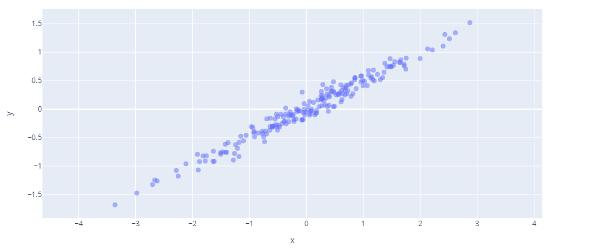

# Reducing the Dimensionality of Data with Neural Networks

by G. E. Hinton and R. R. Salakhutdinov

## Abstract

Des données en haute dimension peuvent être un problème et nécessitent parfois d'être représentées avec moins de dimensions pour des applications multiples comme la visualisation, l'accélération algorithmique ou encore le stockage et la compression de données. 

Une méthode classique et largement utilisée dans ce domaine est l'analyse en composantes principales et nous allons expliquer comment l'appliquer.

Nous allons ensuite explorer une méthode de réduction de dimension basée sur une architecture de neurone multicouche "auto-codeurs". Des algorithmes de descente de gradient sont généralement utilisés sur ces architectures mais cela ne fonctionne bien que si les poids initiaux sont proches d'une bonne solution.

Nous allons expliquer et implémenter une solution proposée par [G. E. Hinton et R. R. Salakhutdinov](www.cs.toronto.edu/~hinton/science.pdf) qui permet d'initialiser efficacement les poids du réseau d'auto-encodage profond à l'aide de plusieurs couches consécutives sur le modèle des *Restricted Boltzmann Machines*. Le réseaux pourra ensuite affiner ses poids à l'aide d'un algorithme de descente de gradient afin d'apprendre des codes de faible dimension qui fonctionnent beaucoup mieux qu'un réseau d'auto-encodage naïf.

Enfin, nous allons comparer les résultats obtenus et conclure sur quelle est la plus efficace des solutions présentées.

[TOC]

## Introduction

**TODO**

- Presentation of the problem(s). 

- Previous works (at least a few citations). If relevant, include things that you have seen during the lectures.

- Contributions. Why is the studied method different/better/worse/etc. than existing previous works. 

  

## Analyse en composantes principales

### L'idée

L’analyse en composantes principales (ACP) est une technique très populaire.

En termes simples, l'ACP consiste à effectuer une transformation de coordonnées à partir des axes arbitraires avec lesquels nos données sont exprimées vers un ensemble d'axes "alignés avec les données elles-mêmes". C'est à dire, des axes qui expriment au mieux la dispersion des informations présentes. La dispersion n'est rien d'autre que la variance ou le fait de disposer d'une "information élevée". On peut dire en d'autres termes qu'une dispersion élevée contient une information élevée.

Par conséquent, si nos données sont exprimées par des axes maximisant la représentation de l'information, il est alors possible d'omettre les axes ou les dimensions ayant une variance moindre car ces "composantes" ne participent que très peu à la description des données.
Cela peut par exemple servir à améliorer la rapidité de certains algorithmes en épargnant de nombreux calculs sans trop souffrir de perte de précision.

Selon les points de vue, on peut considérer cette analyse comme une technique descriptive où l’on essaie de résumer les données selon ses dimensions les plus importantes. Cela peut être utilisé comme une technique de visualisation où l’on essaie de préserver la "proximité" entre les individus dans un espace de représentation réduit par exemple.

Nous définirons les termes suivants au fur et à mesure, mais voici le processus résumé :

- Trouver la matrice de covariance pour l'ensemble de données en question
- Trouver les vecteurs propres de cette matrice
- Trier les vecteurs propres/"dimensions" de la plus grande à la plus petite variance
- Projection / Réduction des données : Utiliser les vecteurs propres correspondant à la plus grande variance pour projeter l'ensemble de données dans un espace à dimensions réduites
- Vérification : combien avons-nous perdu en précision dans la représentation des données ?

### Variance et covariance

Techniquement, la variance est la moyenne des différences au carré par rapport à la moyenne. Si vous connaissez bien l'écart type, généralement noté $\sigma$, la variance est juste le carré de l'écart type. 
$$
V = \sigma^2 = {1\over N}\sum_{i=0}^N (x_i - \bar{x})^2
$$
Avec la moyenne notée $\bar{x}$:
$$
\bar{x} = {1\over N}\sum_{i=0}^N x_i
$$
La variance exprime la "propagation" ou "l'étendue" des données.

Exemple d'un jeu de données 2D :

Il est possible de calculer la variance selon les deux axes : 

| axe      | x                  | y                   |
| -------- | ------------------ | ------------------- |
| variance | 1.2526627262767291 | 0.31870756461533817 |

On peut remarquer dans le graphique ci-dessus que $x$ varie "avec" $y$ à peu près. On dit alors que $y$ est "covariant" avec $x$ . 

La covariance indique le niveau auquel deux variables varient ensemble.
Pour la calculer, c'est un peu comme la variance régulière, sauf qu'au lieu d'élever au carré l'écart par rapport à la moyenne pour une variable, nous multiplions les écarts pour les deux variables.
$$
Cov(x,y) = {1\over N-1}\sum_{j=1}^N (x_j-\bar x)(y_j-\bar y)
$$

> Remarque : la covariance d'une variable avec elle même est sa variance.

>  Remarque : On divise ici par $N-1$ au lieu de $N$, donc contrairement à la variance régulière, nous ne prenons pas tout à fait la moyenne. Pour un grand ensemble de données cela ne fait essentiellement aucune différence, mais pour un petit nombre de points de données, l'utilisation de 𝑁 peut donner des valeurs qui ont tendance à être trop petites et donc le $N-1$ a été introduit pour "réduire le biais des petits échantillons".

La covariance de $x$ en fonction de $y$ vaut donc dans notre exemple $0.6250769297631616$

### Matrice de covariance

La matrice de covariance est une matrice qui regroupe la variance et covariance de chaque variable ( ou dimension) avec chaque autres et s'exprime sous la forme :
$$
\begin{pmatrix}
   Cov(x, x) & Cov(x, y) \\
   Cov(x, y) & Cov(y, y) \\
\end{pmatrix}
$$
Le long de la diagonale se trouvera la variance de chaque variable (à un facteur ${(N-1) \over N}$ près), et le reste de la matrice sera constituée des covariances. 

> Remarque : La matrice est *carrée* et puisque l'ordre des variables n'a pas d'importance lors du calcul de la covariance, la matrice sera *symétrique*.

On obtient dans notre exemple : 
$$
\begin{pmatrix}
1.25895751 & 0.62507693 \\
0.62507693 & 0.32030911 \\
\end{pmatrix}
$$
Nous avons donc maintenant une matrice de covariance. L'étape suivante de l'ACP consiste à trouver les "composantes principales". Cela signifie les directions dans lesquelles les données varient le plus. Cela nécessite de trouver des vecteurs propres pour la matrice de covariance de notre ensemble de données.

### Vecteurs propres

D'après le Théorème Spectral, pour une matrice ${\bf A}$ *symétrique réelle* de taille $n\times n$ il existe un ensemble de $n$ vecteurs $\vec{v}_i$ de sorte que la multiplication d'un de ces vecteurs par ${\bf A}$ donne un vecteur proportionnel (d'un facteur $\lambda_i$) à $\vec{v}_i$.
$$
{\bf A} \vec{v}_i = \lambda_i \vec{v}_i
$$
On appelle ces vecteurs les vecteurs propres et les $\lambda_i$ leurs valeurs propres associées.

Nous ne rentrerons pas dans le détails de comment obtenir ces vecteurs et valeurs propres ici car de nombreuses librairies permettent de le faire et beaucoup mieux que nous.

Il s'agit en général pour les cas les plus simples de suivre les étapes suivantes: 

- Trouver les valeurs propres (en résolvant le système $det( \bf{A} - \lambda \bf{I}) = 0$ )
- Pour chaque valeur propre, obtenir un système d'équations linéaires pour chaque vecteur propre et les résoudre

On obtient pour notre jeu de données :

$\lambda_1 = 1.57128949$ et $\lambda_2 = 0.00797714$

$v_1 = \begin{pmatrix}0.89454536 \\ 0.44697717\end{pmatrix}$ et $v_2 = \begin{pmatrix}-0.44697717 \\ 0.89454536\end{pmatrix}$

On remarque bien ici que le vecteur propre $v_1$ indique la direction qui maximise la variance de nos donnée. On a donc bien trouvé ici l'axe "principal" de notre jeu de données. Le deuxième vecteur propre pointe dans la direction de la plus petite variance et est orthogonal au premier vecteur (conséquence du fait que la matrice est symétrique réelle).

>  Remarque : la longueur des vecteurs est exprimée à l'aide de leurs valeurs propre pour illustrer l'importance des différents axes dans la variance de nos données.

### Projection des données

Nous avons maintenant nos composantes (vecteurs propres), et nous les avons "classées" selon leur "importance". Nous allons maintenant éliminer les directions de faible variance moins importantes. En d'autres termes, nous allons projeter les données sur les différentes composantes principales de plus grande variance.

Il est possible par un changement de base d'exprimer nos données selon ces axes principaux :

La matrice de covariance obtenue avec ces données exprimées dans notre nouvelle base donne : 
$$
\approx
\begin{pmatrix}
	1.57128949 & 0 \\
	0 & 0.00797714 \\
\end{pmatrix}
$$
Ce nouveau "système de coordonnées" exprime les données dans des "directions" découplées les unes des autres ($Cov(a_i,a_j) = 0 \quad\forall i \neq j$)

C'est pour cette raison que les vecteurs propres de nos données sont intéressants.

Intuitivement on se doutait bien depuis le début qu'il serait intéressant d'exprimer nos données selon un unique axe, puisque elles s'apparentent grossièrement à une droite.

---

Pour effectuer la projection il va nous suffire de réduire à zéro la dimension de plus petite variance, ce qui reviens à effectué un "changement de base" avec seulement les vecteurs de plus grande variance (dans notre cas, un seul vecteur).

On obtient alors les données suivantes : 

On peut ramener ensuite nos données dans notre base d'origine pour comparer avec nos données d'origine. Cette étape est utilisée uniquement afin de comparer notre projection dans le même "système de coordonnées" que nos données d'origine ou autrement dit dans la même dimension dans le sens où il s'agit ici d'ajouter une dimension "superflue" à nos données ainsi réduite.

### Le cas réel en hautes dimensions

L'ACP est généralement utilisée pour éliminer beaucoup plus de dimensions qu'une seule (comme dans notre exemple 2D). Elle est souvent utilisée pour la visualisation des données, mais aussi pour la réduction des caractéristiques, c'est-à-dire pour envoyer moins de données dans votre algorithme d'apprentissage afin d'améliorer ses performances.

Dans notre cas 2D il était évident qu'une seule direction ou dimension était intéressante pour exprimer nos données ; mais dans les cas de grande dimension, comment savoir combien de dimensions omettre ? En d'autres termes, combien de "composants" doit-on conserver lors de l'ACP ?

Il y a plusieurs façons de faire ce choix. Il faudra généralement faire un compromis entre la précision et la vitesse de calcul. On peut par exemple exprimer sur un graphique la variance des données en fonction du nombre de composantes que l'on garde.

Abordons pour finir cette partie sur l'ACP un exemple plus concret illustrant cette méthode de sélection et un cas "réel" d'application de l'ACP.

### Example: MNIST dataset

Prenons un ensemble d'images de 28x28 pixels représentant des chiffres manuscrits et appliquons l'analyse en composantes principales sur ces images considérées comme des vecteurs de 784 composantes (dans un espace de 784 dimensions donc).

Après calcul des vecteurs et valeurs propres de nos données, traçons le graphe des valeurs propres rangées par ordre décroissant :

On aperçoit ici que les valeurs des valeurs propres décroissent très rapidement. On peut interpréter cela comme une décroissance très rapide de la variances de nos données expliquées par les composantes ; ou autrement dit, "peu" de composantes représentent une partie significative de la variance de nos données. 

> Rappel : plus la valeur propre d'un vecteur propre est grande plus la variance expliquée par ce vecteur est grande

Exprimons maintenant ce même graphique en valeurs cumulées et en normalisant les valeurs propres.

On obtient alors le  graphe de la variance cumulative expliquée en fonction du nombre de composantes.
Ce graphe permet alors de connaître pour un nombre de composantes donné le pourcentage de variance des données expliqué, ce qui peut s'interpréter comme un pourcentage de précision à représenter les données d'origine avec ce nombre de composantes.
On voit par exemple qu'avec seulement 330 composantes il est possible de représenter à 99% nos données d'origine.

---

Pour conclure avec cet exemple, voici un tableau de différents chiffres projetés avec différents niveaux de variance expliquée (et le nombre de composantes retenues).
Les chiffres sous les images correspondent à trois mesures permettant l'évaluation de la qualité de projection des images ; à savoir de haut en bas : le rapport signa-bruit (PSNR), l'erreur quadratique moyenne (MSE) et la structural similarity (SSIM).

## Restricted Boltzmann Machines

Inventées par Geoffrey Hinton, les machines de Boltzmann restreintes sont des réseaux neuronaux peu profonds à deux couches qui constituent les éléments de base des réseaux profonds.

### L'idée

Une RBM est utilisée pour avoir une estimation de la distribution probabiliste d'un jeu de données.

La première couche de la RBM est appelée la couche visible, ou couche d'entrée, et la seconde est la couche cachée.

Nous détaillerons ici plus précisément le fonctionnement d'une RBM de Bernoulli qui considère les unités visibles et cachées comme étant des valeurs binaires.

### Énergie d'activation

On définit l'énergie d'activation d'une machine de Boltzmann restreinte par la formule suivante :
$$
E(\bold v, \bold h) = -\sum_i b_iv_i - \sum_j c_jh_j - \sum_{i,j} w_{ij}v_ih_j
$$
ou matriciellement avec :
$$
E(\bold v, \bold h) = -b^T{\bold v} - c^T{\bold h} - {\bold v}W{\bold h}^T
$$
avec :

- $w_{ij}$ le poids entre le neurone $j$ et le neurone $i$ ($W$)
- $v_i$ l'état du neurone $i$ de la couche visible ($\bold v$)
- $h_j$ l'état du neurone $j$ de la couche cachée ($\bold h$)
- $b_i$ et $c_j$ sont les biais des neurones $v_i$ et $h_j$ d'entrée et de sortie

Cette énergie est interprétée comme l'énergie d'un système physique et on peut définir le score d'une configuration énergétique comme l'inverse de cette énergie. Plus l'énergie est faible (stabilité) plus le score est élevé.
$$
\text{Score} = - E
$$

### Probabilité

Considérons des scores donnés pour des configurations possibles de notre système.
$$
[ 0, 1, 2, 5, 8]
$$
Il est intéressant d'exprimer le score de ces configurations en probabilités et le moyen le plus classique est de normaliser ces scores par la somme de tous les scores :

Cependant des problèmes peuvent survenir avec des scores négatifs car ils peuvent se compenser et la somme peut alors être nulle.

Un moyen naturel peut être de passer à l'exponentielle puis de normaliser, c'est ce qu'on appelle l'opération de softmax.

C'est ainsi que l'on peut définir la probabilité d'avoir une certaine configuration entrée-sortie $(\bold v, \bold h)$ :
$$
P(\bold v, \bold h) = {e^{-E(\bold v, \bold h)} \over Z}
$$
où $Z$ est une constante de normalisation définie ainsi:
$$
Z=\sum_{i,j} e^{-E(\bold v, \bold h)}
$$

### Positionnement du problème

L'idée générale est de modifier les poids $w_{ij}$ pour approcher au mieux la distribution de probabilité de nos données.
C'est différent d'un algorithme plus classique comme une régression par exemple, qui estime une valeur continue basée sur de nombreuses entrées.

En ajustant itérativement les poids en fonction de l'erreur qu'ils produisent ou de leurs scores, une RBM apprend à se rapprocher de la distribution de probabilité des données originales. On pourrait dire que les poids en viennent à refléter la structure de l'entrée au travers des probabilités de la couche cachée.

Considérons un exemple simple dans lequel une personne dispose de trois accessoires :

Une paire de lunette (notée **L**), un parapluie (noté **P**) et une caméra (notée **C**)

Regardons ce qu'elle décide ou non de prendre lorsqu'elle sort de chez elle en fonction des jours de la semaine :

| jour | Lunettes :eyeglasses: | Parapluie :closed_umbrella: | Caméra :camera:    |
| ---- | --------------------- | --------------------------- | ------------------ |
| 0    | :heavy_check_mark:    | :x:                         | :heavy_check_mark: |
| 1    | :x:                   | :heavy_check_mark:          | :x:                |
| 2    | :heavy_check_mark:    | :x:                         | :heavy_check_mark: |
| 3    | :heavy_check_mark:    | :x:                         | :heavy_check_mark: |
| 4    | :x:                   | :heavy_check_mark:          | :x:                |
| 5    | :x:                   | :heavy_check_mark:          | :x:                |
| 6    | :x:                   | :heavy_check_mark:          | :heavy_check_mark: |
| 7    | :heavy_check_mark:    | :x:                         | :heavy_check_mark: |
| 8    | :heavy_check_mark:    | :x:                         | :heavy_check_mark: |
| 9    | :x:                   | :heavy_check_mark:          | :x:                |

Ces données vont constituer nos données d'entrée de la couche d'input.

Considérons maintenant qu'il existe deux facteurs qui pourraient expliquer ces données : la présence ou non de soleil :high_brightness: (noté **S**) et d'averse :sweat_drops: ​(noté **A**) au cours de la journée. ​

Ces facteurs vont constituer la couche cachée de notre système.

Initialisons maintenant tous nos poids à 0 et traçons la probabilité de chaque configuration d'entrée-sortie.

> Nous ignorerons les biais associés aux entrées et sorties dans notre exemple pour plus de simplicité.

> Une configuration est notée avec une suite de lettres montrant la présence ou non de l'accessoire et d'un évènement météorologique.

On constate évidement que toutes les configurations sont équiprobables (car tous nos poids sont nuls et donc l'énergie de chaque configuration est nulle)

On aimerait se rapprocher d'une configuration de probabilités qui représente nos données, c'est-à-dire qui exprime les formations possibles de notre jeu de données.

Dans notre cas voici les configurations qui apparaissent tout au long de la semaine concernant les inputs : 

| jour          | 0                     | 1                 | 2                     | 3                     | 4                 | 5                 | 6                         | 7                     | 8                     | 9                 |
| ------------- | --------------------- | ----------------- | --------------------- | --------------------- | ----------------- | ----------------- | ------------------------- | --------------------- | --------------------- | ----------------- |
| configuration | :eyeglasses: :camera: | :closed_umbrella: | :eyeglasses: :camera: | :eyeglasses: :camera: | :closed_umbrella: | :closed_umbrella: | :closed_umbrella::camera: | :eyeglasses: :camera: | :eyeglasses: :camera: | :closed_umbrella: |

En incluant les configurations possibles de notre couche cachée, il est possible de lister ainsi toutes les configurations (entrée et sortie) envisageables:

- :eyeglasses: :camera:
- :eyeglasses: :camera::sweat_drops:
- :eyeglasses: :camera::high_brightness:
-  :eyeglasses: :camera::high_brightness::sweat_drops: 
- :closed_umbrella:
- :closed_umbrella::sweat_drops:
- :closed_umbrella::high_brightness:
-  :closed_umbrella::high_brightness::sweat_drops: 
- :closed_umbrella: :camera:
- :closed_umbrella: :camera::sweat_drops:
- :closed_umbrella: :camera::high_brightness:
- :closed_umbrella: :camera::high_brightness::sweat_drops: 

On aimerait donc trouver les poids de notre algorithme pour que les configurations ou évènements envisageables aient une grande probabilité et les autres une faible probabilité.

Cela donnerait quelque chose comme cela pour notre exemple :

> L'évènement :eyeglasses: :camera: (LC) a lieu 5 fois dans la semaine. Il est donc normal que cette configuration soit plus probable que l'évènement :closed_umbrella: (P) (qui a lieu 3 fois) ou que l'évènement :closed_umbrella: :camera: (PC) (qui a lieu une unique fois).

### Apprentissage

####  *Contrastive Divergence*

Il faut donc faire converger nos probabilités uniformes initiales (poids nuls) vers les probabilités voulues issues des évènements de notre dataset.
Pour cela, on va donc procéder par itérations sur chaque évènement de notre dataset afin d'augmenter la probabilité de l'évènement considéré et diminuer la probabilité de tous les autres évènements.
Cela donne par exemple pour le 1er jour (1er évènement de notre dataset) :

Voilà ce que cela donne si on effectue ce processus itératif une fois sur chacun des jours de notre dataset:

### Gibbs sampling

Un problème de taille s'impose malheureusement à nous.
En pratique il est impossible de considérer ni même de stocker les évènements dont nous parlons depuis le début.
En effet, il y a $2^{M + N}$ combinaisons d'évènements possible pour une **RBM** ayant une couche visible de taille $M$ et une une couche cachée de taille $N$.

Dans notre exemple cela reste relativement raisonnable : $2^{2+3} = 32$ mais en pratique avec une couche visible de taille **200** et une couche cachée de taille **100** cela nous amène à considérer $2^{300}$ évènements ce qui est plus que le nombre d'atomes dans l'univers observable.

Au lieu d'augmenter la probabilité de tous les évènements probables en fonction de notre donnée d'entrée on va plutôt en sélectionner un de manière aléatoire et augmenter sa probabilité. Puis choisir un autre évènement de manière "aléatoire" et diminuer sa probabilité. Ce processus de deux étapes, si répété suffisamment, va permettre d'approcher le résultat voulu.

Cependant, nous ne voulons pas exactement sélectionner un évènement aléatoirement dans ces deux étapes. 
En effet, il est plus judicieux d'augmenter la probabilité d'une évènement possible suivant une entrée donnée de notre dataset si sa probabilité actuelle est faible. De même, il est souhaitable de diminuer la probabilité d'un évènement actuellement plus probable dans la seconde étape.

---

On peut s'apercevoir que les probabilités conditionnelles des évènements cachés et visibles sont indépendants lorsque les valeurs de l’autre couche sont fixées:
$$
p(h_j = 1 | \bold v) = \sigma(b_i +\sum_i v_iw_{ij})
$$

$$
p(v_i = 1 | \bold h) = \sigma(c_j +\sum_j h_jw_{ij})
$$

avec :
$$
\sigma(x) = { 1 \over 1+ e^{-x}}
$$
Comme on l'a évoqué précédemment, il est impossible de considérer ni même de calculer la probabilité de chaque événement pour choisir de diminuer celui qui possède la plus grand probabilité.

On va donc devoir effectuer un échantillonnage de Gibbs itérativement en ayant connaissance des probabilités conditionnelles indépendantes pour une couche en faisant des aller-retours entre les deux couches comme cela :
$$
h_j^{(n+1)} \sim p(h_j | \bold v^{(n)})  \\
v_i^{(n+1)} \sim p(v_i | \bold h^{(n+1)})
$$
En principe $n$ doit être grand pour que l'échantillonnage soit efficace et reflète réellement un tirage aléatoire. En pratique, ces erreurs sont négligeables et vont être compensées par la suite lors de l'utilisation de ces RBMs dans un processus de fine-tuning par descente de gradient.

---

### Récapitulatif

On peut reformuler l'apprentissage mathématique dans le sens où l'on cherche à trouver les poids (et biais) maximisant le produit des probabilités des évènements de notre jeu de données ($D$).

$$
arg \; \underset{W}{max}\;\underset{\bold v \in D}{\Pi}p(\bold v)
$$

où $p(\bold v) = \sum_{\bold h} p(v,h)$ est la distribution marginale des variables visibles $\bold v$ de la RBM.

On peut enfin exprimer la dérivée nécessaire pour faire évoluer les poids de notre RBM:
$$
{\partial \over \partial W}log(P(v_n)) = \mathbb{E}\left[ {\partial \over \partial W} - E(v, h) | v= v_n \right] - \mathbb{E}\left[ {\partial \over \partial W} - E(v, h) \right]
$$

> **Remarque :**
>
> Jusqu'à présent nous avons considéré des valeurs d'entrée et de sortie binaires. Mais cela pose un problème lorsque l'on s'intéresse à des données plus complexes (continues) comme des images par exemple.
>
> Après quelques modifications il est possible de généraliser et considérer des valeurs continues sous quelques contraintes de normalisation de ces valeurs (sous forme de distribution gaussienne par exemple).

## Solution proposée

Le but de de la recherche proposée est de réduire la dimensionnalité de nos données sur la base d'une structure de réseaux auto-encodeurs.

Les auto-encodeurs sont un type spécifique de réseaux neuronaux où la taille de l'entrée est la même que la sortie. Ils compriment l'entrée en un code de dimension inférieure et reconstruisent ensuite la sortie à partir de cette représentation. Le code est un "résumé" compact ou une "compression" de l'entrée, également appelée représentation en espace latent (latent-space).
Un auto-codeur se compose donc de trois éléments : l'encodeur, le code et le décodeur. L'encodeur compresse l'entrée et produit le code, le décodeur reconstruit ensuite l'entrée uniquement à l'aide de ce code.

Cependant, il est difficile d'optimiser les poids dans les auto-encodeurs non-linéaires qui ont de nombreuses couches cachées. Avec des poids initiaux élevés, ils trouvent généralement de mauvais minima locaux ; avec des poids initiaux faibles, les gradients dans les premières couches sont très faibles, ce qui rend impossible l'entraînement efficace d'auto-encodeurs avec de nombreuses couches cachées. 

Si les poids initiaux sont proches d'une bonne solution, l'apprentissage et la descente de gradient fonctionnent bien. L'idée est d'utiliser plusieurs RBM en amont pour se rapprocher d'une bonne solution et d'affiner les poids du réseau par descente classique ensuite.

L'architecture proposée est constituée de différentes RBMs successives de plus en plus petites afin de réduire en plusieurs étapes la dimensionnalité des données. 
Ces RMBs sont ensuite utilisées dans l'autre sens (unfolding multicouche) pour constituer la partie que l'on appelle décodeur et qui permet de reconstituer les données à partir de la représentation en dimension inférieure que l'on appelle le code (ou la compression).

## Comparaison et résultats

Pour tester nos résultats nous avons fait le choix d'utiliser le jeu de données bien connu **MNIST** qui nous donne accès à des images de 28x28 pixels représentant des chiffres écrits à la main. 

### Modèle 784-1000-500-250-3

Dans un premier temps nous avons testé une architecture proposée dans le papier de recherche en changeant seulement la taille de la dernière couche d'encodage (3 dimensions au lieu de 2) pour pouvoir visualiser le résultat en 3D. Cela va nous permettre de comparer avec une analyse en composante principale (PCA) en conservant les trois premières composantes (ce qui reste très peu).

**PCA**

On remarque quelques séparations comme les "1" regroupés en bleu marine en bas à droite et les "0" en marron en haut. Cependant, les trois premières composantes représentent seulement 29,1% de la variance des données ce qui est trop peu pour les représenter correctement en si peu de de dimensions. Voilà ce que la reconstruction donne en images :

.png)

On se rend d'autant plus compte ici que la reconstruction n'est pas du tout fidèle aux données d'origine et n'est pas pertinente pour de la compression.

**RBM**

Ici, le résultat est vraiment plus satisfaisant. Les domaines des différents chiffres sont bien distincts en 3D.

Nous obtenons une erreur quadratique moyenne (MSE) de 19.95 pour les données d'entraînement contre 21.7 sur les données de test. Cela peut s'expliquer facilement par le fait qu'il n'y a pas assez de dimensions pour encoder toute la complexité de nos données malgré une représentation satisfaisant en seulement 3 dimensions. Voilà ci dessous les reconstructions obtenues. 

> On remarque qu'elles sont tout de même assez "floues" par manque de complexité dans la représentation compressée.

.png)

### Modèle 784-1000-500-250-100-30

Il est intéressant maintenant de tester cette approche dans une réduction de dimension raisonnable en pratique et qui devrait donner de meilleurs résultats. Le modèle que nous allons tester est une légère modification d'un modèle proposé dans le papier et est constitué de couches dont les tailles successives sont : 

$$
 784-1000-500-250- 100-30
$$
Une dimension de 30 éléments pour le code représentant nos données devrait être suffisant pour conserver la complexité des données du dataset MNIST.

**PCA**

.png)

La reconstruction obtenue grâce à l'analyse en composantes principales est légèrement meilleure, cependant les 30 dimensions représentent seulement 74,6 % de la variance de nos données. Cela reste trop peu et on l'observe clairement dans la reconstruction ci-dessus.

**RBM**

Regardons ce que cela donne en utilisant les RBMs et la structure proposée :

.png)

La reconstruction sur la gauche est nettement plus convaincante avec une erreur moyenne (MSE) de 2.2 pour les données d'entraînement et de 3.5 pour les données de test ce qui est vraiment satisfaisant. Ici la dimension d'encodage permet de conserver la complexité des données tout en réduisant drastiquement la dimensionnalité de celles-ci de près de ${784\over30} \approx 26$ fois !

## Conclusion

Comme nous venons de le voir, l'approche de pré-apprentissage en utilisant des RBMs s'avère très convaincante. Cela permet d'entrainer un réseau auto-encodeur dans un temps raisonnable tout en produisant des résultats honorables.

Pour égaler ces résultats, une approche par composantes principales devrait quant à elle conserver près de 450 (sur 784) dimensions pour le dataset MNIST contre seulement 30 pour l'approche proposée.

Cette réduction est intéressante et a plusieurs applications dont deux importantes en pratique:

- Le stockage et la compression pure des données
- L'amélioration de la rapidité d'entraînement d'un algorithme de classification

Une amélioration pertinente serait d'utiliser une autre fonction d'erreur plus adaptée aux images plutôt que la MSE utilisée jusqu'à présent. En effet des erreurs comme le PSNR ou la SSIM pourraient être qualitativement plus pertinentes pour comparer des images.

Une force de cette approche par rapport à une approche naïve d'un auto-encodeur par descente de gradient est le fait que l'étape de pré-entraînement par RBM permet au modèle d'être construit directement autour des données à modéliser.

> "Pretraining helps generalization because it ensures that most of the information in the weights comes from modeling the images".

Cette approche permet de contre balancer l'un des point faible des auto-encodeur à savoir la complexité en temps de l'entraînement par rapport à la taille des donnés 

> "All three conditions are now satisfied. Unlike nonparametric methods (15, 16), autoencoders give mappings in both directions between the data and code spaces, and they can be applied to very large data sets because both the pretraining and the fine-tuning scale linearly in time and space with the number of training cases."

Bien que les RBMs soient parfois encore utilisées, cette technique devient peu à peu dépréciée au profit de réseaux adversaires générateurs (GAN) ou d'auto-codeurs variationnels (VAE) plus performants et permettant d'obtenir des résultats plus intéressants notamment du point de vue de la génération de données et de la représentation de l'espace latent.

On peut citer quelques papiers de recherche qui abordent ces sujets : 

- https://www.worldscientific.com/doi/10.1142/S1469026820500029
- https://arxiv.org/abs/2002.10464
- https://www.biorxiv.org/content/10.1101/2020.07.17.207993v1.full.pdf

## Bibliographie

[G. E. Hinton* and R. R. Salakhutdinov]: https://www.cs.toronto.edu/~hinton/science.pdf	"Reducing the Dimensionality of Data with Neural Networks"
[Luis Serrano]: https://www.youtube.com/watch?v=Fkw0_aAtwIw	"Restricted Boltzmann Machines - A friendly introduction"
[3Blue1Brown]: https://www.youtube.com/watch?v=PFDu9oVAE-g	"Les vecteurs propres et valeurs propres"

[Geoffrey Hinton]: http://www.cs.toronto.edu/~hinton/absps/guideTR.pdf	"A Practical Guide to Training Restricted Boltzmann Machines"
[Geoffrey E. Hinton and Simon Osindero]: http://www.cs.toronto.edu/~hinton/absps/fastnc.pdf	"A fast learning algorithm for deep belief nets"
[Chris Nicholson]: https://wiki.pathmind.com/restricted-boltzmann-machine	"A Beginner's Guide to Restricted Boltzmann Machines"

## Annexes

Visualisation des étapes d'entraînement des RBMs pour le modèle **784-1000-500-250-100-30** :

> à gauche les données et à droite leur reconstruction par RBM

